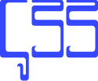

<!-- LOGO INICIO -->
<section id= "top">

  

   

 

<!-- PRESENTACIÓN DEL REPOSITORIO -->
## Acerca de este repositorio - 👀

¡Bienvenido a <strong>codeSampler</strong>! Aquí comparto una variedad de ejemplos y ejercicios que he creado, tanto como parte de mi desarrollo personal como en mi formación en programación y diseño web. Este repositorio alberga proyectos que abarcan lenguajes de marcas, estilos y programación.

Mi objetivo es documentar mi evolución desde un punto inicial de conocimientos básicos. A medida que continúo explorando y ampliando mis habilidades en estos campos, comparto los resultados aquí. Espero poder ver cómo evolucionan mis capacidades con el tiempo.

 

## Índice del Repositorio - 📑
1. Lenguaje de marcas
    * [HTML](#HTML)
2. Lenguaje de estilos
    * [CSS](#CSS)
3. Lenguaje de programación
    * [Java](#Java)
    * [Python](#Python)
 
 
 

  

 

<section id= "html">

  

### 1. EJEMPLOS
   * [Ejemplos HTML](https://github.com/Sailok25/codeSampler/tree/main/HTML/ejemplos)
### 2. EJERCICIOS
   * [Ejercicios HTML](https://github.com/Sailok25/codeSampler/tree/main/HTML/ejercicios)

 
 
 
 
 
 

  

 

<section id= "CSS">

  

### 1. EJEMPLOS
   * [Ejemplos CSS](https://github.com/Sailok25/codeSampler/tree/main/CSS/ejemplos)
### 2. EJERCICIOS
   * [Ejercicios CSS](https://github.com/Sailok25/codeSampler/tree/main/CSS/ejercicios)

 
 
 
 
 
 

  

 

<section id= "Java">

  

### 1. EJEMPLOS
   * [Ejemplos Java](https://github.com/Sailok25/JAVA)
### 2. EJERCICIOS CLASE
   * [Ejercicios Java de Clase](https://github.com/Sailok25/JAVA/tree/main/ejercicios_clase)
### 3. EJERCICIOS PERSONAL
   * [Ejercicios Java Personales](https://github.com/Sailok25/JAVA/tree/main/ejercicios_personales)
### 4. EXAMEN
   * [Exámenes Java](https://github.com/Sailok25/JAVA/tree/main/examen/exercicis)

 
 
 
 
 
 

<section id= "Python">

  

### 1. EJEMPLOS
   * [Ejemplos Python](https://github.com/Sailok25/Python)
### 2. EJERCICIOS
   * [Ejercicios Python](https://github.com/Sailok25/Python/tree/main/ejercicios)

 

## Agradecimientos - ⚜️
* [Ejercicios de referencia](http://desarrolloweb.dlsi.ua.es/libros/html-css/ejercicios)
* [INS Alfons Costafreda](https://www.insalfonscostafreda.cat/)
* [Font Space](https://www.fontspace.com/)
* [W3Schools](https://www.w3schools.com/)
* [ChatGPT](https://chat.openai.com)

(<a href="#top">back to top</a>)

